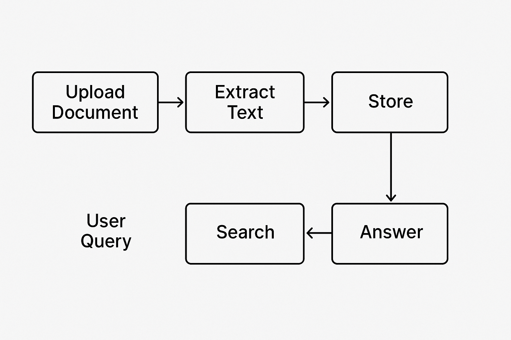

# NFlow Technical Architecture

## Overview

NFlow is built as a modern web application with a Next.js frontend and a modular backend architecture. The system leverages vector embeddings and natural language processing to provide intelligent document processing and knowledge management capabilities.

## System Architecture



### Core Components

1. **Frontend Layer**
   - Next.js application with React components
   - Ant Design UI framework for interface elements
   - Client-side state management

2. **API Layer**
   - Next.js API routes for backend functionality
   - RESTful API design for external integration
   - Authentication and authorization middleware

3. **Processing Layer**
   - Document extraction and parsing services
   - Text chunking and processing utilities
   - Embedding generation with OpenAI API

4. **Storage Layer**
   - Prisma ORM for database operations
   - Vector database for similarity search (NBase or local SQLite)
   - File storage for document management

5. **Integration Layer**
   - External API connectors
   - Webhook system for event notifications
   - Export/import functionality

## Data Flow

1. **Document Ingestion**
   ```
   Upload → Parse → Extract text → Chunk text → Generate embeddings → Store vectors
   ```

2. **Knowledge Query**
   ```
   Query text → Generate embedding → Vector search → Retrieve results → Format response
   ```

3. **Workflow Automation**
   ```
   Trigger event → Execute workflow steps → Process documents → Store results → Notify
   ```

## Technology Stack

### Frontend
- **Next.js**: React framework for server-rendered pages
- **React 19**: Component-based UI library
- **Ant Design**: UI component library
- **Tailwind CSS**: Utility-first CSS framework
- **XYFlow**: Flow diagram visualization

### Backend
- **Next.js API Routes**: Serverless function endpoints
- **Prisma**: Database ORM and migration management
- **OpenAI API**: Vector embedding generation
- **NBase**: Vector database for similarity search

### Database
- **SQLite** (default): File-based relational database
- **PostgreSQL** (optional): Advanced relational database

### Infrastructure
- **Node.js**: JavaScript runtime
- **TypeScript**: Typed JavaScript for better developer experience
- **ESLint/TypeScript**: Code quality and consistency
- **NPM**: Package management

## Module Breakdown

### Core Services

#### Document Service
Handles document parsing, extraction and management. Processes various file formats and extracts structured information.

```typescript
interface DocumentService {
  parseDocument(file: File): Promise<ParsedDocument>;
  extractText(parsedDoc: ParsedDocument): Promise<string>;
  chunkText(text: string): Promise<TextChunk[]>;
  storeDocument(parsedDoc: ParsedDocument): Promise<string>;
}
```

#### Embedding Service
Generates vector embeddings from text chunks using OpenAI's embedding models.

```typescript
interface EmbeddingService {
  generateEmbedding(text: string): Promise<EmbeddingResponse>;
  generateEmbeddingsInBatches(texts: string[]): Promise<EmbeddingResponse[]>;
}
```

#### Vector Database Service
Manages storage and retrieval of vector embeddings for semantic search.

```typescript
interface VectorDBService {
  storeVectors(fileId: string, vectors: Vector[]): Promise<boolean>;
  searchSimilar(query: Vector, filters?: Object): Promise<SearchResult[]>;
  deleteVectors(fileId: string): Promise<boolean>;
}
```

#### Knowledge Service
Provides knowledge graph and structured information management.

```typescript
interface KnowledgeService {
  createKnowledge(data: KnowledgeInput): Promise<Knowledge>;
  getKnowledgeById(id: string): Promise<Knowledge>;
  updateKnowledge(id: string, data: KnowledgeInput): Promise<Knowledge>;
  deleteKnowledge(id: string): Promise<boolean>;
}
```

### Database Schema

The core data model includes the following entities:

- **User**: Application users and authentication
- **Knowledge**: Knowledge base containers
- **File**: Document file metadata
- **TextChunk**: Text segments with vector embeddings
- **Workflow**: Automated processing workflows
- **WorkflowStep**: Individual steps in a workflow
- **WorkflowRun**: Execution record of a workflow


## Vector Embedding System

NFlow uses vector embeddings to enable semantic search capabilities. The system supports two vector database options:

### Local Vector Storage
- Vectors stored directly in SQLite database
- In-memory comparison for similarity search
- Suitable for smaller datasets and simple deployments

### NBase Vector Database
- Specialized vector database for high-performance similarity search
- Clustering and indexing for efficient retrieval
- Optimized for large datasets with millions of vectors

Vector embedding generation is handled by OpenAI's embedding models, with `text-embedding-3-small` as the default model. The system can be configured to use different models if needed.

## Security Architecture

NFlow implements several security measures:

1. **Authentication**: JWT-based authentication system
2. **Authorization**: Role-based access control for resources
3. **Input Validation**: Validation of all user inputs
4. **HTTPS**: Secure communication in production environments
5. **Environment Isolation**: Separation of sensitive configuration

## Deployment Architecture

NFlow can be deployed in various configurations:

### Development Environment
- Local Node.js server
- SQLite database
- Embedded NBase server

### Production Environment (Recommended)
- Node.js application server
- PostgreSQL database
- Dedicated NBase server
- Reverse proxy (Nginx/Apache)

### Serverless Deployment (Optional)
- Vercel/Netlify for Next.js
- Managed PostgreSQL database
- NBase on dedicated VM or container

## Performance Considerations

1. **Embedding Generation**: Batched to avoid API rate limits
2. **Vector Search**: Indexing for large datasets
3. **Database Scaling**: Connection pooling for high concurrency
4. **File Processing**: Streaming for large files
5. **Caching**: Results caching for frequent queries

## Error Handling and Monitoring

1. **Structured Logging**: Consistent logging format across services
2. **Error Classification**: Categorizing errors for better handling
3. **Circuit Breaking**: Preventing cascading failures
4. **Health Checks**: Regular monitoring of system components
5. **Performance Metrics**: Tracking response times and resource usage

## Future Architecture Considerations

1. **Microservices**: Breaking down monolithic components
2. **Message Queue**: Asynchronous processing for better scalability
3. **Container Orchestration**: Kubernetes for complex deployments
4. **Multi-region Deployment**: Geographical distribution for low latency
5. **AI Model Integration**: Additional AI capabilities beyond embeddings
